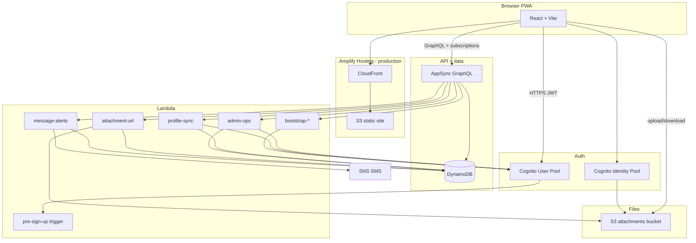
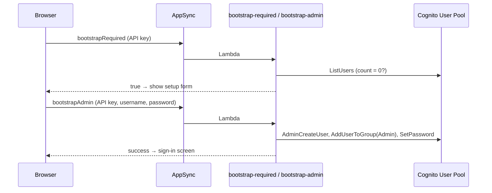
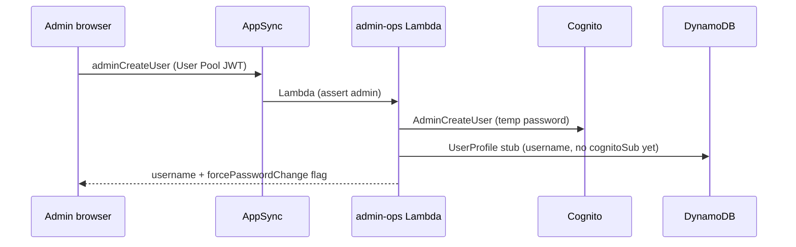
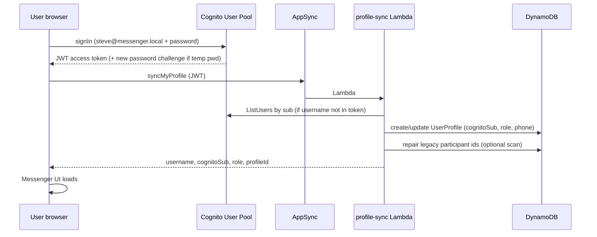
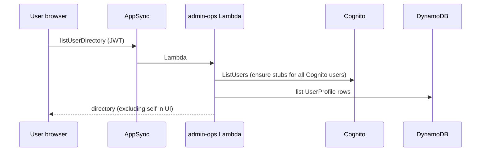
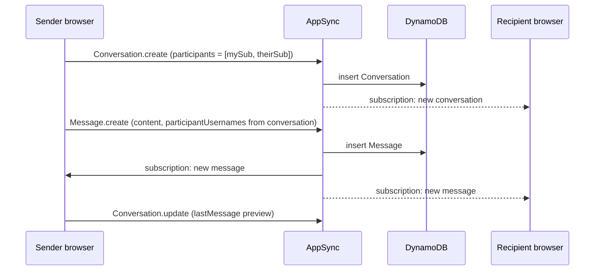
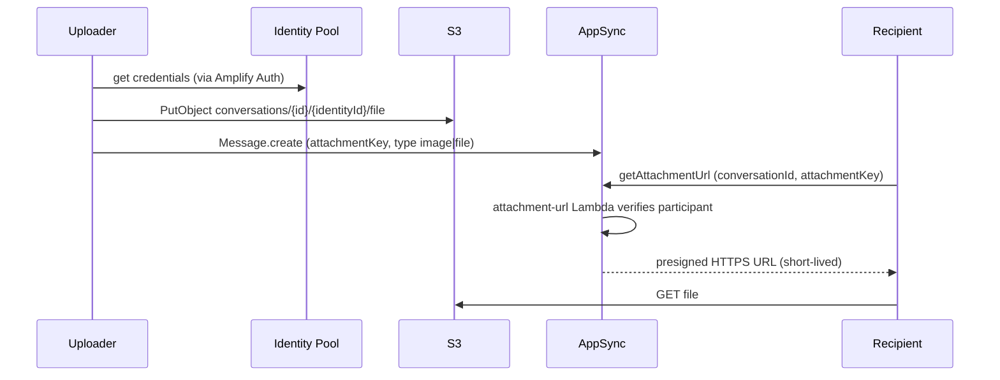
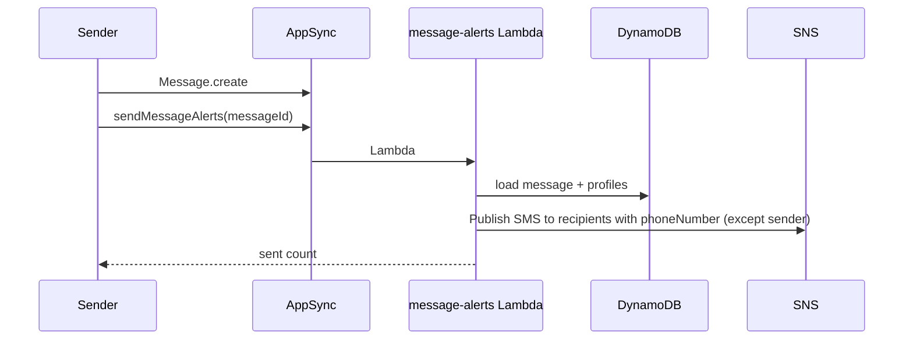

# Architecture

This doc explains **what AWS runs**, **how pieces connect**, and **what happens step-by-step** when someone uses the messenger.

It looks like a lot of services because **Amplify Gen 2 generates infrastructure for you** (IAM roles, AppSync resolvers, DynamoDB tables, Cognito identity pool for S3 uploads, CloudFormation stacks). You did not hand-wire 40 microservices — you defined ~10 TypeScript files under `amplify/` and Amplify expanded them.

---

## TL;DR — service count

| Category | AWS services you are actually using | Count |
| -------- | ----------------------------------- | ----- |
| **User-facing** | CloudFront, S3 (×2 buckets), Cognito User Pool, Cognito Identity Pool, AppSync, DynamoDB, Lambda, SNS | **9 types** |
| **Deployment / ops** (invisible but present) | CloudFormation, IAM, CloudWatch Logs, SSM (CDK bootstrap) | **4 types** |
| **CI hosting** (production only) | Amplify Hosting build pipeline | **1** |

**Custom Lambda functions you wrote:** 7  
**DynamoDB tables (GraphQL models):** 3 (`UserProfile`, `Conversation`, `Message`)

For a small private chat app, that is normal for Amplify Gen 2 — not because the product needs enterprise complexity, but because **auth + realtime GraphQL + file uploads** each pull in their own managed pieces.

---

## High-level diagram



**Local dev:** the browser still talks to the same cloud services; only the React bundle is served from `localhost:5173` via Vite. Config comes from `amplify_outputs.json`.

---

## What each service does (plain English)

| Service | Role in this app |
| ------- | ---------------- |
| **CloudFront + S3 (hosting)** | Serves the built React app (`dist/`) over HTTPS. Created by **Amplify Hosting** on git push. |
| **Cognito User Pool** | Stores users, passwords, `preferred_username`, optional phone, `Admin` group. Issues JWT access tokens for AppSync. |
| **Cognito Identity Pool** | Gives the browser temporary AWS credentials so the signed-in user can **upload** attachments to S3 under `conversations/...`. |
| **AppSync** | GraphQL API + **WebSocket subscriptions** for real-time chat. Default auth = User Pool JWT. Also exposes an API key for bootstrap-only calls. |
| **DynamoDB** | Stores profiles, conversations, messages (one table per GraphQL `@model`). On-demand billing. |
| **S3 (attachments)** | Binary files (images, documents). Path pattern: `conversations/{conversationId}/{identityId}/...` |
| **Lambda (7)** | Business logic that must run server-side: admin, bootstrap, profile sync, presigned URLs, SMS, sign-up trigger. |
| **SNS** | Sends optional SMS when a new message arrives and recipients have phone numbers. |
| **CloudFormation** | Amplify/CDK deploys and updates all of the above as stacks. |
| **IAM** | Roles so each Lambda can call Cognito, DynamoDB (via Amplify data client), S3, SNS. |
| **CloudWatch Logs** | Lambda stdout/stderr (use `npm run sandbox -- --stream-function-logs`). |

---

## Data model

```
UserProfile          Conversation              Message
─────────────        ────────────              ───────
id                   id                        id
username             name?                     conversationId  → Conversation
cognitoSub?          isGroup                   content?
displayName?         participants[]  (subs)     senderUsername
avatarColor?         lastMessage?              participantUsernames[] (subs)
role (admin|user)    lastMessageAt?            type (text|image|file)
phoneNumber?         messages →                attachmentKey?
                                               attachmentName?
```

**Important naming quirk:** fields called `participants` / `participantUsernames` store Cognito **`sub` UUIDs**, not handles like `steve`. Authorization uses `identityClaim('sub')`.

**GSIs:** `UserProfile` by `username` and `cognitoSub`; `Message` by `conversationId`.

---

## Authorization summary

| Operation | Who can call | How enforced |
| --------- | ------------ | ------------ |
| Bootstrap (`bootstrapRequired`, `bootstrapAdmin`) | Anyone with **API key** (embedded in frontend config) | AppSync API key auth; only safe when pool is empty |
| Sign-in | User + password | Cognito User Pool |
| Chat CRUD (`Conversation`, `Message`) | Users whose **sub** is in participant arrays | AppSync owner rules |
| Read `UserProfile` | Any signed-in user | AppSync `authenticated` read |
| Write `UserProfile` | Lambdas only (`syncMyProfile`, admin create stub) | IAM via Lambda |
| `listUserDirectory` | Any signed-in user | Lambda lists all profiles (IAM) |
| Admin mutations | Signed-in **admin** (Cognito `Admin` group or `UserProfile.role`) | Lambda checks identity |
| Upload attachment | Signed-in user | S3 via Identity Pool credentials |
| Download attachment | Conversation participant | `getAttachmentUrl` Lambda verifies membership, returns presigned URL |
| SMS alert | Any signed-in user (today) | `sendMessageAlerts` Lambda → SNS |

---

## Workflows

### 1. First deploy — empty user pool (bootstrap)



After this, bootstrap endpoints should never be needed again for that environment.

---

### 2. Admin creates a user



New user appears in **New chat** immediately but shows **“not signed in yet”** until first login.

---

### 3. User sign-in + profile sync



Every successful login runs **`syncMyProfile`** — this is how production gets the correct username (not Cognito’s internal UUID).

---

### 4. Open “New chat” — load directory



Fallback: if the custom query fails, client tries `UserProfile.list` directly.

---

### 5. Start chat + send a text message



Real-time delivery is **AppSync GraphQL subscriptions** over WebSockets — no custom websocket server.

---

### 6. Send attachment



Uploader writes directly to S3; other participants never get bucket-wide access.

---

### 7. Optional SMS on new message



SMS is **best-effort**; failures are logged, not shown prominently in UI.

---

## Lambda reference

| Function | Trigger | Calls |
| -------- | ------- | ----- |
| `pre-sign-up` | Cognito sign-up trigger | Auto-confirms user (if sign-up API used) |
| `bootstrap-required` | AppSync query | Cognito ListUsers → is pool empty? |
| `bootstrap-admin` | AppSync mutation | Cognito create admin user + Admin group |
| `admin-ops` | AppSync queries/mutations | Cognito admin APIs, DynamoDB via IAM, directory listing |
| `profile-sync` | AppSync `syncMyProfile` | Cognito ListUsers (username resolve), DynamoDB profile upsert + repair |
| `attachment-url` | AppSync query | DynamoDB membership check, S3 presigned GET |
| `message-alerts` | AppSync mutation | DynamoDB message/participants, SNS Publish |

All GraphQL-connected Lambdas run inside the **AppSync → Lambda** pipeline (not API Gateway).

---

## Frontend structure

```
App.tsx
  ├─ SetupNotice          (no amplify_outputs / no pool)
  ├─ BackendUpgradeNotice (old schema missing bootstrap API)
  └─ AuthGate             (bootstrap | sign-in | new-password | authed)
       └─ Messenger
            ├─ ConversationList   (observeQuery Conversation)
            ├─ ChatView           (observeQuery Message)
            ├─ NewChatModal       (listUserDirectory)
            ├─ AdminPanel         (admin* mutations)
            └─ ProfileSettings    (syncMyProfile, phone for SMS)
```

Config: `amplify_outputs.json` (generated on deploy). GraphQL client uses **`authMode: 'userPool'`** for data calls.

---

## Deploy environments

| Environment | How created | URL | Data |
| ----------- | ----------- | --- | ---- |
| **Personal sandbox** | `npm run sandbox` | `localhost:5173` + cloud APIs | Isolated stack per developer/identifier |
| **Amplify Hosting** | Git push → `amplify.yml` | `https://main.<id>.amplifyapp.com` | Separate stack; own Cognito pool |

Same codebase, **different** `amplify_outputs.json` values. Users and messages do **not** sync between sandbox and production.

### Production build pipeline (`amplify.yml`)

1. `npm ci`
2. `npx ampx pipeline-deploy` — deploy/update backend, write outputs
3. `npm run build` — TypeScript + Vite → `dist/`
4. Amplify publishes `dist/` to hosting CDN

---

## Real-time path (why AppSync exists)

Without AppSync subscriptions you would need API Gateway + WebSocket API + Lambda + DynamoDB streams + connection management. Amplify Data gives you:

- CRUD resolvers → DynamoDB
- `@model` subscriptions → automatic publish on write
- Client `observeQuery()` → local cache + live updates

That is why the stack includes AppSync even for a “simple” chat app.

---

## What is *not* in the architecture

| Not used | Notes |
| -------- | ----- |
| EC2 / EKS / containers for app logic | Static site + managed APIs only |
| RDS / Postgres | DynamoDB only |
| API Gateway (for your code) | AppSync invokes Lambdas directly |
| SES | SMS via SNS, not email |
| FCM / web push | Not implemented |
| ElastiCache / Redis | No caching layer |
| SQS / EventBridge | No async job queue (SMS is synchronous invoke) |

---

## Sanity check: is this “nuts”?

**For what you built** (private realtime chat + admin + attachments + optional SMS on serverless free tier):

- **Reasonable** — Amplify Gen 2 trades “few moving parts in repo” for “more AWS resources in the account.”
- **Heavy for 2 users** — yes, DynamoDB + AppSync + 7 Lambdas is overkill for a spreadsheet with refresh, but it scales to real-time and mobile PWA without you operating servers.
- **Main complexity is Amplify-generated glue**, not your application logic (~15 React components, ~7 small Lambdas).

If you ever wanted a **minimal** version: static site + Cognito + API Gateway WebSocket + one Lambda + one DynamoDB table — fewer services, much more code you maintain yourself.

---

## Related docs

- [README.md](../README.md) — run locally, deploy, manage users
- [AWS-GETTING-STARTED.md](./AWS-GETTING-STARTED.md) — AWS account setup, troubleshooting, git push
